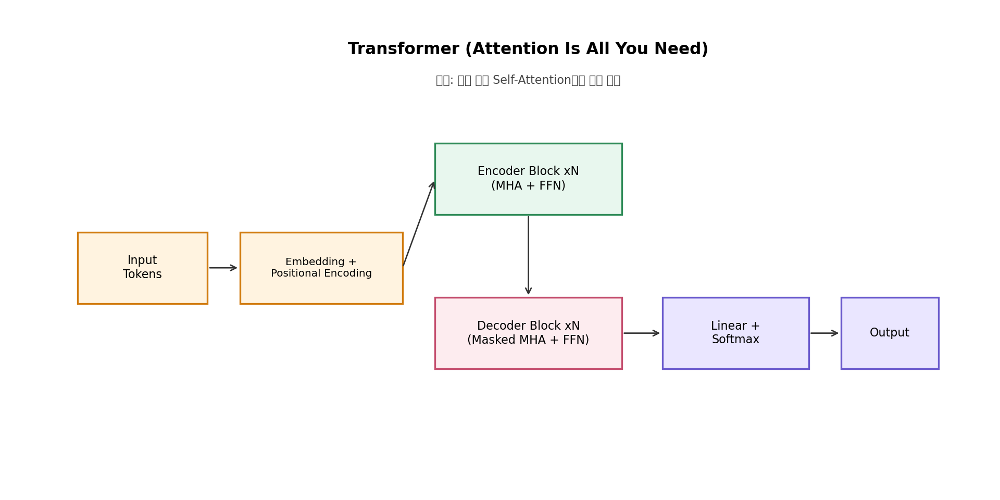
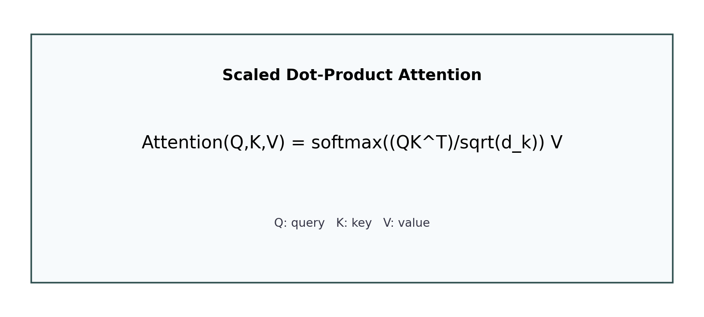

# Attention Is All You Need 구현 노트

## 구현 목표
논문 구조를 완전 복제하기보다는, 핵심 원리(Self-Attention + Positional Embedding + Encoder Stack)를 재현 가능한 코드로 구현한다.

## 현재 구현 스펙
- 모델: `TransformerLM` (PyTorch `nn.TransformerEncoder` 기반)
- 데이터셋: `WikiText-2 (wikitext-2-raw-v1)`
- 토크나이즈: 공백 기준 단순 분할
- 학습: `AdamW`, gradient clipping
- 지표: `train_loss`, `validation perplexity`

## 재현성 체크리스트
- seed 고정: `random`, `numpy`, `torch`, `torch.cuda`
- 결과 저장: `results/result_*.txt`
- 그래프 저장: `results/metric_curve_*.png`
- 실행 로그: `logs/run_*.log`
- 메트릭 누적: 프로젝트 루트 `metrics.csv`

## 코드 구조 메모
- `run_experiment()`
  - 데이터 로드
  - vocab 구성
  - 학습 루프
  - 주기적 검증
  - 결과 파일/그래프 저장
- `evaluate()`
  - `CrossEntropyLoss` 평균
  - `perplexity = exp(loss)` 계산

## 추후 개선 아이디어
1. BPE/SentencePiece 토크나이저 도입
2. 학습률 스케줄러(워밍업) 추가
3. mixed precision 학습(fp16/bf16)
4. multi-seed 평균 성능 리포트
5. 실험 설정을 YAML로 분리

## 참고 이미지

